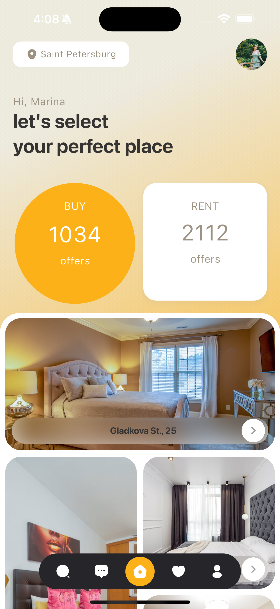

# real_estate_app

A real estate app POC.

This Real Estate app is built with Flutter.

## Screenshots

### Home Screen



### Search Screen


## ✨ Requirements

- Any Operating System (ie. MacOS X, Linux, Windows)
- Any IDE with Flutter SDK installed (ie. Android Studio, VSCode, IntelliJ, etc)
- A little knowledge of Dart and Flutter

## Run Locally

```bash
  git clone https://github.com/lexican/real_estate_app.git
  cd real_estate_app
  flutter pub get
  flutter run
```
